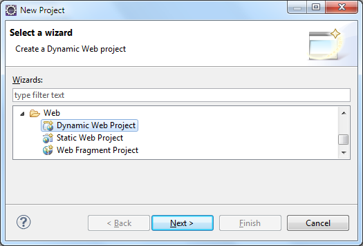

快速入门 Quick Start
--------------------------

jetbrick 推荐使用 Eclipse IDE for Java EE Developers 做为开发环境。最新版下载地址：http://www.eclipse.org/downloads/

下面，我们以一个用户登录的例子来简单的学习一下如何使用 jetbrick 来进行快速开发。

### 创建 Dynamic Web Project

请用你的 Eclipse IDE 根据下面的向导，快速新建一个动态 Web 项目。

#### 新建 Web 工程


#### 填写项目信息


推荐使用 Servlet API 3.0 以上的标准。

#### 设置 Build Path


推荐使用例子中的 source 文件结构 (Maven 标准) ，以及使用对应的 Output folder 路径。

#### 设置 Web Module


#### 新建项目信息汇总

根据上面新建的 Web 项目，将会具有如下的目录结构：

* /src/main/java/
* /src/main/resources/
* /src/test/java/
* /src/test/resources/
* /WebContent/WEB-INF/web.xml
* /WebContent/WEB-INF/lib/
* /WebContent/WEB-INF/classes/

我们假设你的 Java 项目的包都在 `jetbrick.docs.samples` 下面，然后部署在 `http://127.0.0.1:8080/jetbrick_docs_samples/` 下面。

### 增加 jetbrick 依赖包

**普通用户**

将如下的 jars 复制到工程的 /WebContent/WEB-INF/lib/ 目录下面，然后加入到 Build Path 中去。

* jetbrick-all-1.0.0.jar
* slf4j-api-1.7.7.jar
* slf4j-simple-1.7.7.jar  (可选包)
* fastjson-1.1.38.jar (可选包)

以上 jars 你可以在 jetbrick-all-xxx.zip 中找到。

对于 jetbrick 来说，我们只依赖于 `slf4j-api`，没有其他的第三方依赖。

**Maven 用户**

使用如下 Maven 坐标信息

```xml
<dependency>
  <groupId>com.github.subchen</groupId>
  <artifactId>jetbrick-all</artifactId>
  <version>1.0.1</version>
</dependency>
<dependency>
  <groupId>com.alibaba</groupId>
  <artifactId>fastjson</artifactId>
  <version>1.1.38</version>
  <optional>true</optional>
</dependency>

```

### 配置 web.xml

```xml
<?xml version="1.0" encoding="UTF-8"?>

<web-app xmlns="http://java.sun.com/xml/ns/javaee"
         xmlns:xsi="http://www.w3.org/2001/XMLSchema-instance"
         xsi:schemaLocation="http://java.sun.com/xml/ns/javaee
                             http://java.sun.com/xml/ns/javaee/web-app_3_0.xsd"
         version="3.0">

    <filter>
        <filter-name>jetbrick-webmvc</filter-name>
        <filter-class>jetbrick.web.mvc.DispatcherFilter</filter-class>
        <init-param>
            <param-name>configLocation</param-name>
            <param-value>/WEB-INF/jetbrick-webmvc.properties</param-value>
        </init-param>
    </filter>
    <filter-mapping>
        <filter-name>jetbrick-webmvc</filter-name>
        <url-pattern>/*</url-pattern>
    </filter-mapping>

</web-app>
```

### 配置 /WEB-INF/jetbrick-webmvc.properties

```
web.development = true
web.http.encoding = utf-8
web.scan.packages = jetbrick.docs.samples
web.router.bypass = *.ico, *.jsp, /assets/*
web.urls.router = jetbrick.web.mvc.router.RestfulRouter
web.view.default = jsp
```

### 创建一个 Controller

```java
package jetbrick.docs.samples.controllers;

import javax.servlet.http.HttpSession;
import jetbrick.web.mvc.action.*;
import jetbrick.web.mvc.action.annotations.RequestForm;
import jetbrick.web.mvc.ioc.annotations.Inject;
import com.alibaba.fastjson.JSONAware;

@Controller(singleton=true)
public class PassportController {
    @Inject
    private PassportService passportService;

    @Action(value = "/passport/login", method = HttpMethod.GET)
    public String login() {
        return "login.jsp";
    }

    @Action(value = "/passport/login", method = HttpMethod.POST)
    public JSONAware login(
            @RequestParam("username") String username,
            @RequestParam("password") String password
    ) {
        boolean pass = passportService.validate(username, password);
        if (pass) {
            return JSON.ok();
        } else {
            return JSON.fail("Username or password is invalid.");
        }
    }

    @Action("/passport/logout")
    public String logout(HttpSession session) {
        session.invalidate();
        return "redirect:/passport/login";
    }
}
```

### 创建一个 PassportService

PassportService 用来提供用户名密码认证服务。范例代码中，使用了固定的用户名和密码，实际代码应该是从数据库中进行验证。

```java
package jetbrick.docs.samples.services;

@IocBean
public class PassportService {

    public boolean validate(String username, String password) {
        return "admin".equals(username) && "admin".equals(password);
    }
}
```

### 创建登录页面 /WebContent/passport/login.jsp

```html
<!DOCTYPE html>
<html>
<head><meta charset="utf-8"></head>
<body>
<form action="./login" method="post">
    Username: <br/>
    <input type="text" name="username" size="30" /><br/>
    Password: <br/>
    <input type="password" name="password" size="30" /><br/>
    <input type="submit" value="Login" />
</form>
</body>
</html>
```

### 放在 Tomcat 里面运行

好了，尝试将你的 Web 项目部署到 Tomcat 中去吧，然后运行。

#### 打开 Servers View


#### 新建一个 Tomcat Server


#### 选择本地 Tomcat 服务器安装路径


#### 选择要部署的 Web 项目


#### 启动 Tomcat


#### 打开你的浏览器

输入：http://127.0.0.1:8080/jetbrick_docs_samples/passport/login


### 完整 demo 下载

你可以在 http://subchen.github.io/jetbrick/download.html 中下载最新的 demo 实例代码。


